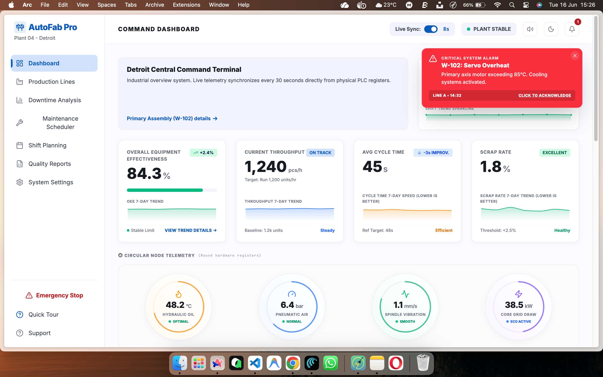
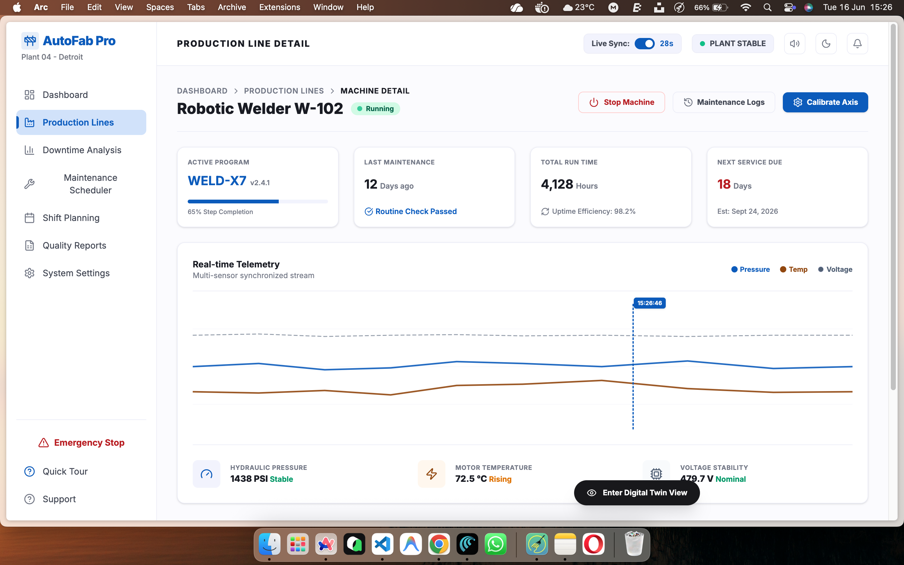
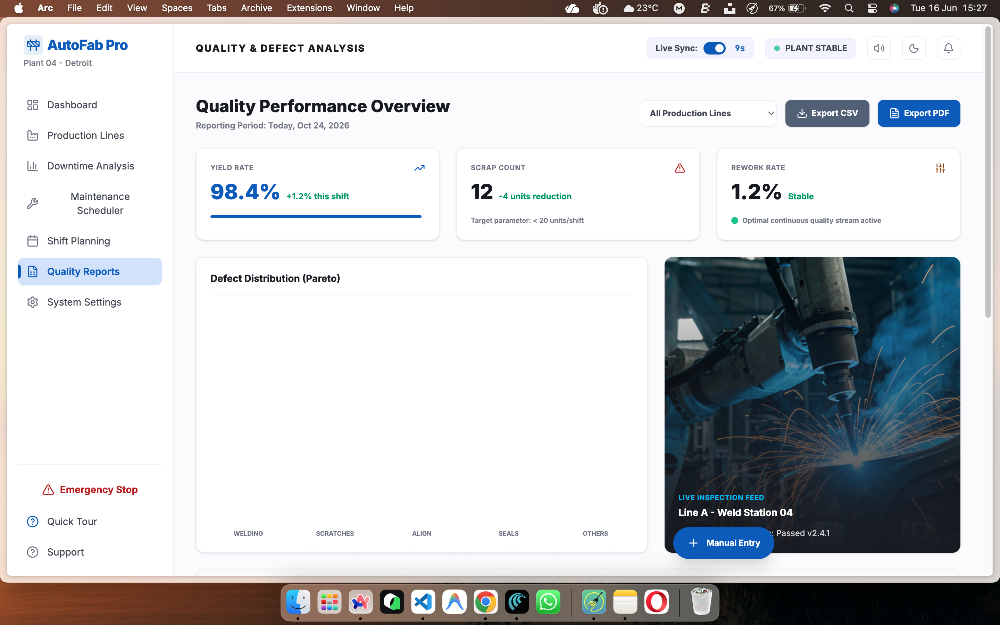
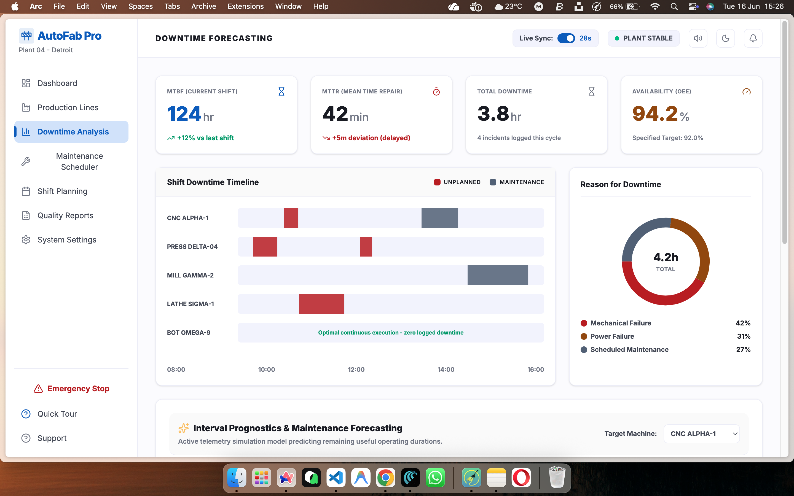
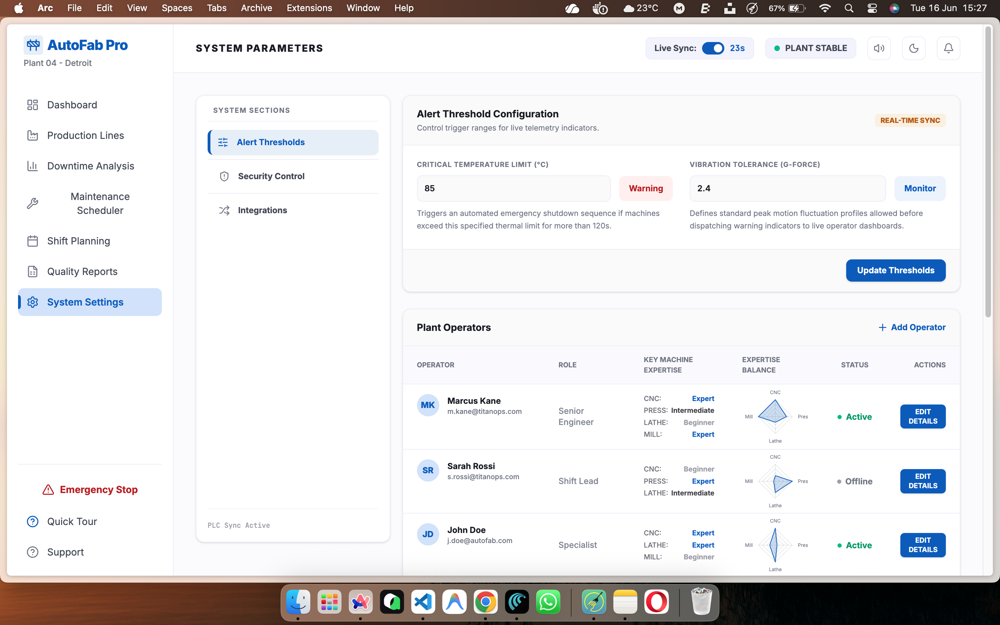

# Smart Manufacturing System

This repo contains a web app with:
- **Frontend**: React + Vite
- **Backend**: Flask API (SQLite database)

## Screenshots

Frontend UI screenshots are stored in `assets/screenshots/`.

<div align="center">

| Dashboard | Production / Analytics |
|---|---|
|  |  |

| Reports | Downtime / Analysis |
|---|---|
|  |  |

| Maintenance Scheduler | Settings |
|---|---|
|  |  |

</div>


## Prerequisites
- **Node.js** (for the frontend)
- **Python 3** (for the backend)

## Run the Backend (Flask)

1. Create and activate a Python virtual environment:
   ```bash
   python3 -m venv .venv
   source .venv/bin/activate
   ```

2. Install backend dependencies:
   ```bash
   pip install -r backend/requirements.txt
   ```

3. Start the Flask API:
   ```bash
   python backend/app.py
   ```

The backend listens on:
- **http://127.0.0.1:5000**

## Run the Frontend (Vite)

1. Install frontend dependencies:
   ```bash
   npm install
   ```

2. Start the dev server:
   ```bash
   npm run dev
   ```

The frontend dev server runs on **http://localhost:3000**.

## Frontend ↔ Backend Integration
The frontend API base URL is configured in `src/apiClient.ts`:
- `http://127.0.0.1:5000`

## Build (optional)

```bash
npm run build
npm run preview
```

